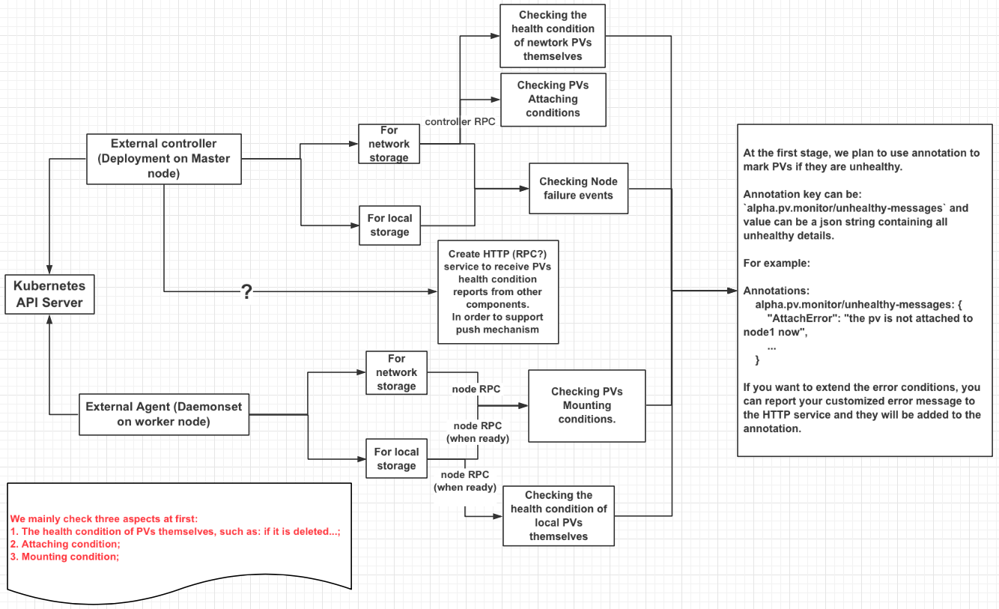

# PV Health Monitor

## Table of Contents

  * [Title](#title)
      * [Table of Contents](#table-of-contents)
      * [Motivation](#motivation)
      * [User Experience](#user-experience)
         * [Use Cases](#use-cases)
      * [Proposal](#proposal)
      * [Implementation](#implementation)
         * [API change](#api-change)
         * [CSI change](#csi-change)
         * [External controller](#external-controller)
         * [External agent](#external-agent)
         * [Simple reactions](#simple-reactions)
         * [Alternative](#alternative)
      * [Implementation History](#implementation-history)


## Motivation

For now, Kubernetes has no way to monitor PVs. This may cause serious problems.

For example, volumes are unhealthy but pods still try to write data to them. This will lead to data loss.

If nodes break down, as a result local PVs in the nodes can no longer be accessed any more. This is also a case that should be monitored.

So it is necessary to have a mechanism to monitor PVs.

## User Experience

### Use Cases

Many things could happen to the underlying storage system after a volume is provisioned in Kubernetes.

* Volume could be deleted by accident outside of Kubernetes.
* The disk that the volume resides on could be removed temporarily for maintenance.
* The disk that the volume resides on could fail.
* There may be configuration issues with the underlying storage system that affect the volume’s health.
* Volume could be out of capacity.
* The disk may be degrading which affects its performance.

If the volume is mounted on a pod and used by an application, the following problems could also happen.
* There may be read/write I/O errors.
* The file system on the volume may be corrupted.
* Filesystem may be out of capacity.
* Volume may be unmounted by accident outside of Kubernetes.

If the CSI driver has implemented the CSI volume health function proposed in this design document, Kubernetes could communicate with the CSI driver to retrieve any errors detected by the underlying storage system. Kubernetes can store this data on the associated PV so that user can inquire this information and decide how to handle them. For example, if the volume is out of capacity, user can request a volume expansion to get more space. Kubernetes may also use volume health information stored on the PV to automatically reconcile.

There could be conditions that cannot be reported by a CSI driver. There could be network failure where Kubernetes may not be able to get response from the CSI driver. In this case, a call to the CSI driver may time out. There could be network congestion which causes slow response. One or more nodes where the volume is attached to may be down. This can be monitored and detected by the volume health controller so that user knows what has happened.

## Proposal

In this proposal, we only focus on PV monitoring, and reactions are not in the scope.

- If one PV’s volume provisioned by storage driver is deleted, we need to mark the PV to inform users;

- If mounting error occurs, we also need to mark the PV;

- If other errors occur, we need to mark the PV too;

- If volume errors are detected by other components deployed by users, we need to mark the PV.

The main architecture is as below:



The following areas will be the focus of this proposal at first:

- The health condition checking of PVs themselves, such as if the PV is deleted, if the usage is reaching the threshold, and so on.
- Mounting conditions checking.
- Other errors that could affect the usability of the volume.

In addition, a service will be created to receive PV health condition reports from other compoments implemented and deployed by users.

Three main parts are involved here in the architecture.

- API changes: Annotation will be used to mark PVs if they are unhealthy at the first stage.
- External Controller:
  - Trigger controller RPC to check the health condition of network PVs themselves for network storage;
  - Watch for node failure events for both network and local storage;
  - Create HTTP(RPC) service to receive PVs health condition reports; 

- External Agent:
  - Trigger node RPC to check PVs’ mounting conditions for network storage;
  - Trigger controller and node RPC (when ready) to check local PVs health condition for local storage;
    - For now, we do not have CSI support for local storage, we may check the local PVs directly by the agent at first, and then move the checks to RPC interfaces when ready.


## Implementation

### API changes

At the first stage, annotation will be used to mark PVs if they are unhealthy.

Annotation key can be: `alpha.pv.monitor/unhealthy-messages` and value can be a json string containing all unhealthy details.

For example:
```
Annotations: 
    alpha.pv.monitor/unhealthy-messages: {
        "DiskFull": "disk running out of space",
        ...
    }
```

We can also use PV Taints to mark PVs as an alternative, see the alternative section below.

### CSI changes

Container Storage Interface (CSI) specification will be modified to provide volume health check leveraging existing controller and node RPCs.

- ListVolumes RPC
  - External controller calls `ListVolumes` to check the health condition of PVs themselves. For example, check if the PVs are deleted or having health problems which affect their usability. A `volume_id` can be used as a filter to query a particular volume.
- NodeGetVolumeStats RPC
  - For any PV that is mounted, the external agent calls `NodeGetVolumeStats` to see if volume is still mounted;
  - Calls `NodeGetVolumeStats` to check if volume is usable, e.g., filesystem corruption, bad blocks, etc.

Two new controller capabilities are added. If a CSI driver supports `LIST_VOLUMES_WITH_ID` capability, it MUST support calling `ListVolumes` with the `volume_id` filtering. If a driver supports `LIST_VOLUMES_HEALTH`, it MUST provides health information in `ListVolumesResponse`.

A new node capability is added. If CSI driver supports the `GET_VOLUME_STATS_HEALTH` capability, it MUST provide health information in NodeGetVolumeStats.

Detailed changes needed in the CSI Spec are described in the following.

##### Enhance ListVolumes RPC

In the existing `ListVolumes` RPC, add `volume_id` field as a filter. When calling `ListVolumes` with a specific `volume_id` returns empty, it indicates the volume no longer exists.

Add `VolumeHealth` message in `VolumeStatus` field in `ListVolumesResponse`.  This can indicate additional health information for the volume.

Whether the volume is still attached to a node is already handled by `LIST_VOLUMES_PUBLISHED_NODES` controller capability. This capability will be used by Kubernetes to reconcile - re-attach the volume if the volume is not attached any more.

```
message ListVolumesRequest {
  // If specified (non-zero value), the Plugin MUST NOT return more
  // entries than this number in the response. If the actual number of
  // entries is more than this number, the Plugin MUST set `next_token`
  // in the response which can be used to get the next page of entries
  // in the subsequent `ListVolumes` call. This field is OPTIONAL. If
  // not specified (zero value), it means there is no restriction on the
  // number of entries that can be returned.
  // The value of this field MUST NOT be negative.
  int32 max_entries = 1;

  // A token to specify where to start paginating. Set this field to
  // `next_token` returned by a previous `ListVolumes` call to get the
  // next page of entries. This field is OPTIONAL.
  // An empty string is equal to an unspecified field value.
  string starting_token = 2;

  // Identity information for a specific volume. This field is
  // OPTIONAL. It can be used to list only a specific volume.
  // ListVolumes will return with current volume information.
  string volume_id = 3;
}
```

```
message ListVolumesResponse {
  message VolumeStatus{
    // A list of all `node_id` of nodes that the volume in this entry
    // is controller published on.
    // This field is OPTIONAL. If it is not specified and the SP has
    // the LIST_VOLUMES_PUBLISHED_NODES controller capability, the CO
    // MAY assume the volume is not controller published to any nodes.
    // If the field is not specified and the SP does not have the
    // LIST_VOLUMES_PUBLISHED_NODES controller capability, the CO MUST
    // not interpret this field.
    // published_node_ids MAY include nodes not published to or
    // reported by the SP. The CO MUST be resilient to that.
    repeated string published_node_ids = 1;

    // Health shows error conditions reported by the SP.
    // This field is optional.
    repeated VolumeHealth health = 2;
  }

  message Entry {
    // This field is REQUIRED
    Volume volume = 1;

    // This field is OPTIONAL. This field MUST be specified if the
    // LIST_VOLUMES_PUBLISHED_NODES controller capability is
    // supported.
    VolumeStatus status = 2;
  }

  repeated Entry entries = 1;

  // This token allows you to get the next page of entries for
  // `ListVolumes` request. If the number of entries is larger than
  // `max_entries`, use the `next_token` as a value for the
  // `starting_token` field in the next `ListVolumes` request. This
  // field is OPTIONAL.
  // An empty string is equal to an unspecified field value.
  string next_token = 2;
}
```

```
message VolumeHealth {
  // The error code describing the health condition of the volume.
  // This field is REQUIRED.
  string error_code = 1;

  // The error message associated with the above error_code. This field is OPTIONAL.
  string message = 2;
}
```

Add `LIST_VOLUMES_WITH_ID` and `LIST_VOLUMES_HEALTH` controller capabilities.  If a driver supports `LIST_VOLUMES_WITH_ID` capability, it MUST supports the `volume_id` field in `ListVolumesRequest`.  If a driver supports `LIST_VOLUMES_HEALTH`, it MUST supports the `health` field in the `status` field in `ListVolumesResponse`.

```
// Specifies a capability of the controller service.
message ControllerServiceCapability {
  message RPC {
    enum Type {
      UNKNOWN = 0;
      CREATE_DELETE_VOLUME = 1;
      PUBLISH_UNPUBLISH_VOLUME = 2;
      LIST_VOLUMES = 3;
      GET_CAPACITY = 4;
      // Currently the only way to consume a snapshot is to create
      // a volume from it. Therefore plugins supporting
      // CREATE_DELETE_SNAPSHOT MUST support creating volume from
      // snapshot.
      CREATE_DELETE_SNAPSHOT = 5;
      LIST_SNAPSHOTS = 6;

      // Plugins supporting volume cloning at the storage level MAY
      // report this capability. The source volume MUST be managed by
      // the same plugin. Not all volume sources and parameters
      // combinations MAY work.
      CLONE_VOLUME = 7;

      // Indicates the SP supports ControllerPublishVolume.readonly
      // field.
      PUBLISH_READONLY = 8;

      // See VolumeExpansion for details.
      EXPAND_VOLUME = 9;

      // Indicates the SP supports the
      // ListVolumesResponse.entry.published_nodes field
      LIST_VOLUMES_PUBLISHED_NODES = 10;

      // Indicates the SP supports the
      // volume_id field in ListVolumesRequest
      LIST_VOLUMES_WITH_ID = 11;

      // Indicates the SP supports the
      // ListVolumesResponse.entry.volume_health field
      LIST_VOLUMES_HEALTH = 12;
    }

    Type type = 1;
  }

  oneof type {
    // RPC that the controller supports.
    RPC rpc = 1;
  }
}
```

##### Add Node Volume Health Function

Node Volume Health checks if a volume is still mounted and usable. To check whether a volume is usable, the CSI driver shall check if filesystem is corrupted, whether there are bad blocks, etc. in this RPC.

Instead of adding a new RPC, we can leverage the existing NodeGetVolumeStats RPC.

```
rpc NodeGetVolumeStats (NodeGetVolumeStatsRequest)
    returns (NodeGetVolumeStatsResponse) {}
```

In the NodeGetVolumeStatsRequest, there are `volume_id`, `volume_path`, and `staging_target_path`. CSI driver can figure out whether a volume is still mounted based on these parameters.

In NodeGetVolumeStatsResponse, there is already a `VolumeUsage` which includes information (available, used, and total) of the file system on the volume.

A new message `VolumeHealth` will be added to `NodeGetVolumeStatsResponse`. A new Node capability `VOLUME_STATS_HEALTH` will be added to indicate whether a CSI driver has implemented this function. In a `VolumeHeath` message, there is an error code indicating the type of code and a message that describes the details of the error.

```
message NodeGetVolumeStatsRequest {
  // The ID of the volume. This field is REQUIRED.
  string volume_id = 1;

  // It can be any valid path where volume was previously
  // staged or published.
  // It MUST be an absolute path in the root filesystem of
  // the process serving this request.
  // This is a REQUIRED field.
  string volume_path = 2;

  // The path where the volume is staged, if the plugin has the
  // STAGE_UNSTAGE_VOLUME capability, otherwise empty.
  // If not empty, it MUST be an absolute path in the root
  // filesystem of the process serving this request.
  // This field is OPTIONAL.
  string staging_target_path = 3;
}
```

```
message NodeGetVolumeStatsResponse {
  // This field is OPTIONAL.
  repeated VolumeUsage usage = 1;
  // This field is OPTIONAL.
  repeated VolumeHealth volume_health = 1;
}
```

```
message VolumeUsage {
  enum Unit {
    UNKNOWN = 0;
    BYTES = 1;
    INODES = 2;
  }
  // The available capacity in specified Unit. This field is OPTIONAL.
  // The value of this field MUST NOT be negative.
  int64 available = 1;

  // The total capacity in specified Unit. This field is REQUIRED.
  // The value of this field MUST NOT be negative.
  int64 total = 2;

  // The used capacity in specified Unit. This field is OPTIONAL.
  // The value of this field MUST NOT be negative.
  int64 used = 3;

  // Units by which values are measured. This field is REQUIRED.
  Unit unit = 4;
}
```

```
message VolumeHealth {
  // The error code describing the health condition of the volume.
  // This field is REQUIRED.
  string error_code = 1;

  // The error message associated with the above error_code. This field is OPTIONAL.
  string message = 2;
}
```

Add a `GET_VOLUME_STATS_HEALTH` node capability. If driver supports this capability, it MUST fetch `volume_health` information in `NodeGetVolumeStats`.

```
message NodeGetCapabilitiesRequest {
  // Intentionally empty.
}
```

```
message NodeGetCapabilitiesResponse {
  // All the capabilities that the node service supports. This field
  // is OPTIONAL.
  repeated NodeServiceCapability capabilities = 1;
}
```

```
// Specifies a capability of the node service.
message NodeServiceCapability {
  message RPC {
    enum Type {
      UNKNOWN = 0;
      STAGE_UNSTAGE_VOLUME = 1;
      // If Plugin implements GET_VOLUME_STATS capability
      // then it MUST implement NodeGetVolumeStats RPC
      // call for fetching volume statistics.
      GET_VOLUME_STATS = 2;
      // See VolumeExpansion for details.
      EXPAND_VOLUME = 3;
      // If Plugin implements GET_VOLUME_STATS_HEALTH capability
      // then it MUST implement NodeGetVolumeStats RPC
      // call for fetching volume health information.
      GET_VOLUME_STATS_HEALTH = 4;

    }

    Type type = 1;
  }

  oneof type {
    // RPC that the controller supports.
    RPC rpc = 1;
  }
}
```

### External controller

#### CSI interface
Call ListVolumes() RPC for network storage PVs periodically to check the health condition of PVs themselves

#### Node failure event
Watch node failure event for both network and local storage. 
If node breaks down, the  mounting conditions could not be detected by external agent any more, we need to mark the PV there.

#### HTTP(RPC) service
Create a HTTP(RPC) service to receive PVs health condition reports from other components. 
Users can extend the PV health condition monitoring by setting up their own detector and report the result to the service.

### External agent

#### CSI interface
Call NodeGetVolumeStats() RPC for network storage to check the mounting and other health conditions.
Call both ListVolumes() and NodeGetVolumeStats() RPCs for local storage when local storage CSI support is enabled.
For now, check local PVs directly by the agent.


### Simple reactions:

For unbound PVCs/PVs,  we need to prevent binding marked PVs to PVCs.

### Alternative

In addition to PV health annotation, we can also reuse the PV Taints and introduce a new Taint called PVUnhealthMessage for PV health condition whose key is specific (PVUnhealthMessage) and value can be set differently. 

For example, if the PV is not attached now, we can mark the PV using the PVUnhealthMessage taint like this:
```
Key: “PVUnhealthMessage”
Value: “AttachError,the pv is not attached to node1 now”
VolumeTaintEffect: NoEffect
```

If the volume is deleted, we can mark the PV using the PVUnhealthMessage taint like this:
```
Key: “PVUnhealthMessage” 
Value: “VolumeError, the volume is deleted from backend”
VolumeTaintEffect: NoEffect
```

Note that:

- all the VolumeTaintEffects are NoEffect now at first, we may talk about the reactions later in another proposal;
- the taint Value is string now, it is theoretically possible that several errors are detected for one PV, we may extend the string to cover this situation: combine the errors together and splited by semicolon or other symbols.


## Implementation History

- 20191021: KEP updated

- 20190730: KEP updated

- 20190530: KEP submitted

- Demo implementation (using annotations): 
https://github.com/NickrenREN/kubemonitor/tree/master/build/kube_storage_monitor/local_monitor
https://github.com/NickrenREN/kubemonitor/tree/master/build/kube_storage_monitor/node_watcher
